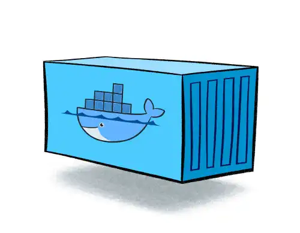
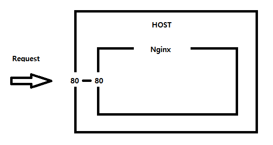
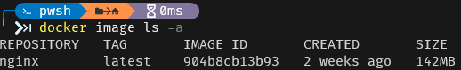
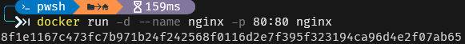
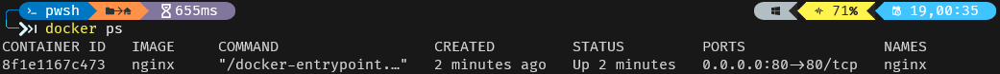

## Container란?

Software는 OS와 library의 의존성을 가진다. 하나의 컴퓨터에서 성격이 다른 software를 실행할 때 호환 문제 및 어려움을 가질 수 있으며 관련된 환경구성 및 유지보수가 어렵다.

Container는 각 software의 실행에 필요한 환경을 독립적으로 가질 수 있도록 기초 환경 또는 다른 실행 환경과의 충돌을 막고 실행의 독립성을 확보해주는 OS 수준의 격리 기술을 말한다. Container는 application의 실제 구동 환경으로부터 추상화 및 코드와 모든 종속성을 가진 것을 패키징 할 수 있는 software의 표준 단위 입니다.

Container는 가상화 기술 중 하나로 대표적으로 Linux Container가 있다. 기존 OS를 가상화 시키던 것과 달리 **Container는 OS레벨의 가상화로 프로세스를 격리시켜 동작하는 방식이다.**

## VM vs Container

{: width="100%"}

VM은 Host OS 위에 가상화를 시키기 위한 **Hypervisor**엔진을 이용하여 여러 개의 OS를 하나의 호스트에서 생성하여 사용하는 방식으로 **가상화된 하드웨어 위에 OS가 올라가는 형태로 거의 완벽하게 Host와 분리된다.**

*여기서 **HyperVisor**는 각 Guest OS에게 Host의 자원을 각각 분배를 해주는 역할을 한다.*

Hypervisor를 이용한 가상화를 보면 Host OS와 완전히 분리되는 장점은 있지만 OS위에 OS를 올리기 때문에 무겁고 느릴수 밖에 없는 구조다.

또한 독립적인 플랫폼을 가지기 위해서는 하나씩 증가를 시켜야하고 불필요한 OS를 만드는 작업을 계속 진행 해야된다. 

여기서 OS만 올라가는 게 아닌 Guest OS를 사용하기 위한 library, kernel등 전부 포함하기 때문에 이 가상머신을 다른 환경에 배포하기 위해 이미지로 만들었을 때 이 이미지 용량 또한 커지게 된다.

즉, 가상 머신은 완벽한 OS를 만들 수 있다는 장점은 있지만 일반 Host에 비해 성능 손실이 있으며 수 기가바이트에 달하는 가상 머신 이미지를 application으로 배포하기는 어렵다는 단점이 있다.

#### **반면**

컨테이너 기반 가상화는 Docker 엔진 위에 application 실행에 필요한 binary만 올라간다.

또한 하나의 서버에 여러 개의 컨테이너를 실행하면 서로 영향을 미치지 않고 독립적으로 실행할 수 있다.

이 때 Docker는 container를 생성하기 위해 Linux 내장 기능인 **chroot**, **namespace**, **cgroup**을 사용하여 프로세스 단위로 격리 환경을 만들기 때문에 성능 손실이 거의 없다고 봐도 무방하다.

그리고 컨테이너 기반 가상화는 Host OS 그리고 Docker 엔진위에서 바로 동작하며 Host OS와 커널을 공유하며 커널을 공유하게 되면 **I/O(input/output)처리가 쉽게 되어 성능의 효율을 높일 수 있다**.

컨테이너에 필요한 커널은 호스트의 커널을 공유해 사용하고, 컨테이너 안에는 애플리케이션을 구도하는 데 필요한 library, binrary 및 실행 파일만 존재하기 때문에 컨테이너를 이미지로 만들었을 때 이미지의 용량 또한 가상 머신에 비해 완전히 줄어듭니다.

간략히,
컨테이너를 사용하는 것은 가상머신을 생성하는 것이 아니라 Host OS가 사용하는 자원을 분리하여 여러 환경을 만들 수 있도록 하는 것이다.

## Make nginx container

간단하게 nginx 웹서버를 구동 시켜보자


_구조는 요렇게 Host 80번 port에 들어오는 모든 트래픽은 Nginx container의 80번 port로 전달한다._

### Nginx image 다운로드

```bash
docker pull nginx

# nginx 최신 버전 pull
docker pull nginx:latest

# nginx 버전 명시 pull
docker pull nginx:1.16.1
```


_"docker pull nginx" 입력_

### 이미지 조회

```shell
docker image ls -a
```

_Pull 받았던 nginx가 보인다_

### Container 생성
```shell
docker run -d --name nginx -p 80:80 nginx
# docker run -d --name {Container name} -p {host port}:{container port} {image name}
```

> run : Container 생성 명령어.
>
> -d : Container 생성 시 백그라운드에서 실행하는 옵션.
>
> --name : Container의 이름 지정 옵션. (미입력 시 이름은 무작위)
>
> -p : host port number와 conatiner 내부 port를 포워딩 해주는 옵션 ("host":"docker container")


_이상한 문구 나오면 성공_

### Container 조회
```shell
# 현재 실행 되고 있는 container 조회
docker ps

# 모든 Container 조회
docker ps -a
```

_아까 올린 nginx가 보인다_


### 결과 확인
주소창에 [localhost](http://localhost "localhost")로 입력. 
_(web server 기본 port 번호 인 80을 사용했기 때문에 port 번호는 생략)_


위 와 같은 화면이 나오면 컨테이너 생성 완료!
