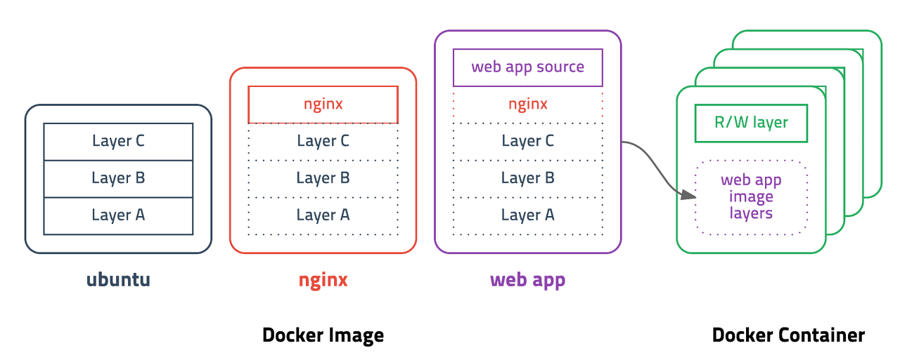

## 선생님 Image가 뭐에요?
Image는 docker에서 **서비스 운영에 필요한 library, 실행파일을 묶은 형태**를 말합니다.

즉, 특정 프로세스를 실행하기 위한 모든 파일 및 환경변수를 가진 것으로, 더 이상의 의존성 파일을 컴파일 및 설치가 필요 없는 **정적인 상태의 파일**을 의미합니다.


예를들어 Node 이미지는 Node를 실행하기 위한 모든 파일을 가지고 있으며 Jenkins 이미지는 Jenkins를 실행하는데 모든 파일, 명령어, 고유 port 정보를 가지고 있습니다.

_그냥 Windows로 따지면 zip파일을 생각하면 이해하기 편해요._

내가 생각하는 image의 큰 장점으로는

1. Docker image의 용량은 보통 수MB ~ 수GB가 넘는다. 하지만 가상머신의 image에 비하면 굉장히 적은 용량.
2. 하나의 image는 복수의 container를 생성할 수 있고, container가 삭제되더라도 image는 변하지 않고 그대로 남아 있음.
3. 도커 이미지들은 github과 유사한 서비스인 DockerHub를 통해 버전 관리 및 배포(push&pull)가 가능하다.
4. Docker는 Dockerfile이라는 파일로 이미지를 만든다. Dockerfile에는 소스와 함께 의존성 패키지 등 사용했던 설정 파일을 버전 관리하기 쉽도록 명시한다.

## Layer
_[Docker - image가 저장되는 방식](https://woochan-autobiography.tistory.com/468)_ 

_[도커 컨테이너(Container)와 이미지(Image)란 ?](https://woochan-autobiography.tistory.com/468)_

Docker image layer는 image를 build 할 때 마다 이미 생성 된 layer가 캐시 되어 재사용 되어 실행되기 때문에 build 시간을 단축할 수 있다.

하지만 Dockerfile에 정의된 모든 command가 layer가 되는 것은 아닙니다.
RUN, ADD, COPY 이 3가지만 layer로 저장되고, CMD, LABEL, ENV, EXPOSE 등 meta 정보를 다루는 부분은 임시로 layer가 생성되지만 저장은 되지 않아 docker image 사이즈에 영향을 주지 않습니다. 



**기존 이미지에 추가적인 파일이 필요할 때, 다시 다운로드를 하는게 아닌 해당 파일을 추가하기 위한 개념이다.**

## Example

간단히 Flask를 dockerizing (이미지화) 해보겠읍니다

디렉토리 구조는
```bash
docker
├── flask
│   └── app.py
├── requirements.txt
└── Dockerfile
```
docker 디렉토리 안에 Dockerfile, requirements (패키지 목록), flask를 넣어준다.

꼭 최상위 폴더 이름이 docker가 아니여도 됩니다.

```
# requirements.txt
Flask
```
requirements.txt에 flask를 추가하고,

```Dockerfile
FROM python:3.8

COPY ./requirements.txt ./requirements.txt
RUN pip install -r requirements.txt

COPY ./flask /flask
WORKDIR /flask

CMD [ "python3", "-m", "flask", "run", "--host=0.0.0.0" ]
```

Dockerfile에는 flask 설치 및 실행하는 command를 추가한다.

```python
from flask import Flask

app = Flask(__name__)

@app.route('/')
def index():
    return "Hello docker image"

if __name__ == "__main__":
    app.run()
```
app.py도 작성해준다.

```shell
docker build -t my-flask .
# docker build -t {repository name}:{version} . (path)
```
Dockerfile이 있는 디렉토리 안에서 위 command 실행

```shell
docker image ls
```

실행 시 
