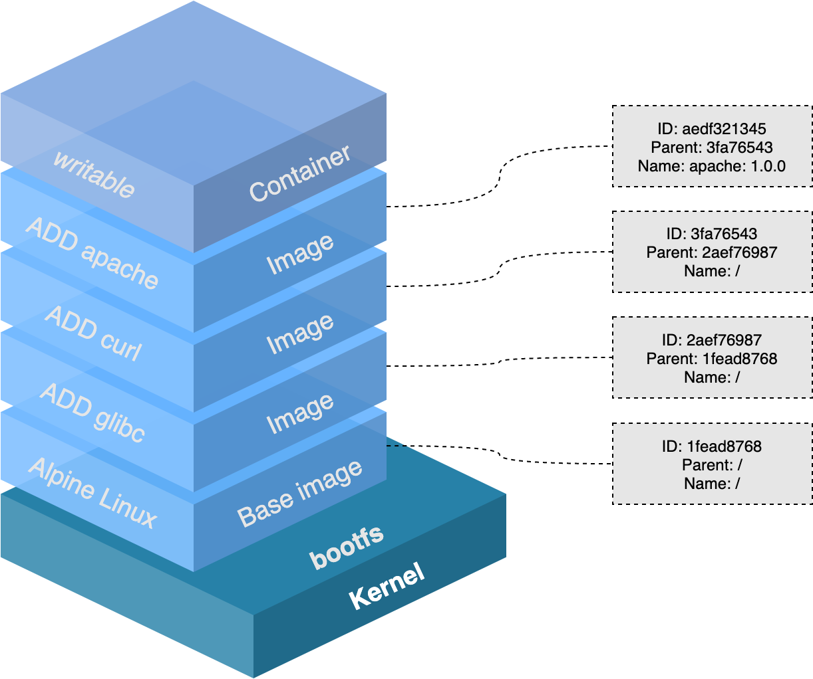
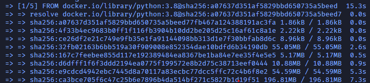
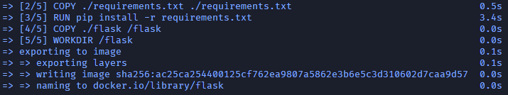
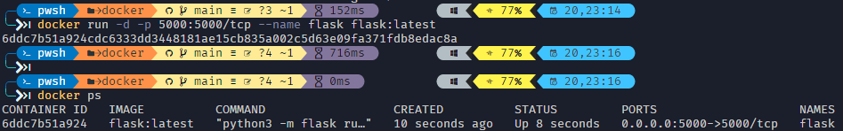

{:width="400px"}

## Image?

Image는 docker에서 **서비스 운영에 필요한 library, 실행파일을 묶은 형태**를 말합니다.

즉, 특정 프로세스를 실행하기 위한 모든 파일 및 환경변수를 가진 것으로, 더 이상의 의존성 파일을 컴파일 및 설치가 필요 없는 **정적인 상태의 파일**을 의미합니다. 


예를들어 Node 이미지는 Node를 실행하기 위한 모든 파일을 가지고 있으며 Jenkins 이미지는 Jenkins를 실행하는데 모든 파일, 명령어, 고유 port 정보를 가지고 있습니다.

_그냥 Windows로 따지면 zip파일을 생각하면 이해하기 편해요._

제가 생각하는 image의 큰 장점으로는

1. Docker image의 용량은 보통 수MB ~ 수GB가 넘는다. 하지만 가상머신의 image에 비하면 굉장히 적은 용량.
2. 하나의 image는 복수의 container를 생성할 수 있고, container가 삭제되더라도 image는 변하지 않고 그대로 남아 있음.
3. 도커 이미지들은 github과 유사한 서비스인 DockerHub를 통해 버전 관리 및 배포(push&pull)가 가능하다.
4. Docker는 Dockerfile이라는 파일로 이미지를 만든다. Dockerfile에는 소스와 함께 의존성 패키지 등 사용했던 설정 파일을 버전 관리하기 쉽도록 명시한다.

## Layer 저장 방식

_[Docker - image가 저장되는 방식](https://woochan-autobiography.tistory.com/468)_

_[Docker — What it is, How Images are structured, Docker vs. VM and some tips (part 1)](https://ragin.medium.com/docker-what-it-is-how-images-are-structured-docker-vs-vm-and-some-tips-part-1-d9686303590f)_


_Docker image를 pull 받게 되면 여러개로 분리 된 조각 형태를 내려받는 것 처럼 보입니다._

이렇게 분리 된 데이터 각각을 **레이어(Layer)** 라고 합니다.

 사진으로 보게 되면,

{: width="700px"}
_Docker layer1_

레이어는 docker image가 build 될 때 Dockerfile에 정의한 명령문을 순서대로 실행하면서 만들어집니다

이 레이어들은 각각 독립적으로 저장되고 readonly이기 때문에 임의로 수정할 수 없습니다


_Docker layer2_

Ubuntu image가 **A + B + C** layer들의 집합이라고 생각하면 Nginx image는 **A + B + C + nginx**가 됩니다.

webapp image를 nginx image 기반으로 만들었다면 **A + B + C + nginx + source** layer로 구성됩니다. webapp 소스를 수정하면 **A, B, C, nginx** 레이어를 제외한 새로운 source(version 2) 레이어만 다운받으면 되기 때문에 굉장히 효율적으로 image를 관리할 수 있습니다.

또한 container 생성 시 layer 방식을 사용합니다. 기존 image layer 위에 read/write layer를 추가합니다. image layer를 그대로 사용하면서 container가 실행중에 생성하는 파일이나 변경된 내용은 읽기/쓰기 layer에 저장되므로 여러개의 container가를 생성해도 최소한의 용량만 사용합니다.

하지만 Dockerfile에 정의된 모든 command가 layer가 되는 것은 아닙니다.
RUN, ADD, COPY 이 3가지만 layer로 저장되고, CMD, LABEL, ENV, EXPOSE 등 meta 정보를 다루는 부분은 임시로 layer가 생성되지만 저장은 되지 않아 docker image 사이즈에 영향을 주지 않습니다. 

간략히 Docker image layer는 **기존 이미지에 추가적인 파일이 필요할 때, 다시 다운로드를 하는게 아닌 해당 파일을 추가하기 위한 개념이며**, image를 build 할 때 마다 이미 생성 된 **layer가 캐시** 되어 **재사용 되어 실행**되기 때문에 **build 시간을 단축**할 수 있습니다.

## Example

간단히 Flask를 dockerizing (이미지화) 해보겠읍니다

디렉토리 구조는 docker 디렉토리 안에 Dockerfile, requirements (패키지 목록), flask를 넣어준다. (꼭 최상위 폴더 이름이 docker가 아니여도 됩니다)

```shell
docker
├── flask
│   └── app.py
├── requirements.txt
└── Dockerfile
```

### Requirments.txt

먼저, requirements.txt에 flask를 추가해 줍니다.

```
# requirements.txt
Flask
```

### Dockerfile

두번째로는 Dockerfile에는 flask 설치 및 실행하는 command를 추가합니다.

```Dockerfile
# Step 1 : Base image는 python3.8을 사용
FROM python:3.8

# Step 2 : copy package list 
COPY ./requirements.txt ./requirements.txt

# Step 3 : package install
RUN pip install -r requirements.txt

# Step 4 : copy source file 
COPY ./flask /flask

# Step 5 : designate work directory
WORKDIR /flask

CMD [ "python3", "-m", "flask", "run", "--host=0.0.0.0" ]
```

### Flask 생성

flask를 실행 할 app.py도 작성해준다.

```python
from flask import Flask

app = Flask(__name__)

@app.route('/')
def index():
    return "Hello docker image"

if __name__ == "__main__":
    app.run()
```

### Image build

Dockerfile이 있는 디렉토리 안에서 아래 command 실행

```shell
docker build -t flask .
# docker build -t {repository name}:{version} . (path)
```

build 시 layer가 총 5step이 나오게 됩니다.


_Build step 1_


_Build step 2_

### Image 조회

```shell
docker image ls
```


_docker image ls 결과_

### Build 된 image 사용

```shell
docker run -d -p 5000:5000/tcp --name flask flask:latest
```


_docker run 결과_

### 결과

[localhost:5000](http://localhost:5000/)에 접속하면 "Hello docker image" 가 나오게 됩니다.

{: width="500px"}
_Good_
