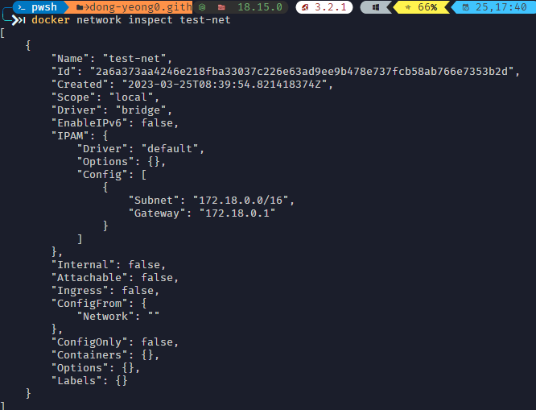
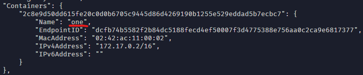

## Network 🤔

Docker container는 각각 격리된 환경에서 실행되기 때문에 기본적으로 다른 container와 통신이 불가능 합니다. 하지만 여려 개의 컨테이너를 하나의 Docker network에 연결을 시키면 서로 통신이 가능해 집니다.

## Network type

```shell
docker network ls
```

docker network ls command로 Docker가 지원하는 network 방식을 확인해 볼 수 있습니다.

{: width="500px"}
_bridge, host, none 3가지가 나오게 됩니다._

<br />

**docker network ls** command options

- **-f, –filter=[] : 조회 시 필터링 기능** (사실상 많이 씀)
- --no-trunc : network 정보를 상세히 출력 (ID 자세히 나옴)
- -q, –quiet : 나머지 정보 제외하고 network ID만 표시

```shell
# driver가 bridge인 network 조회
docker network ls -f driver=bridge

# network 이름이 none인 network 조회
docker network ls -f name=none
```

<br />

Docker network는 **bridge**, **host**, **overlay**, **none** 등등 여러 목적에 따라 여러 종류를 지원하고 있습니다.

### bridge

Docker network의 기본 network driver 입니다. 

driver를 따로 지정하지 않는 경우 default로 들어가게 됩니다.

### host

host network는 container와 host 컴퓨터의 동일한 network에서 container를 돌리기 위해서 사용됩니다.

### none

현재 container의 networking을 비활성화 하는 driver 입니다.

<br />

## Create network

```shell
docker network create test-net
```
default netwokr이 bridge인지 확인하기 위해 test-net 이라는 network를 생성합니다.

```shell
docker network ls -f name=test-net
```


_default인 bridge로 생성된 것을 확인할 수 있습니다._

## Netwokr information 

```shell
docker network inspect test-net
```


_이렇게 network에 대한 상세 정보가 출력됩니다._

위 사진에서 **Containers**라는 항목을 보면 해당 네트워크에 연결되어 있는 docker container가 없는 것을 확인할 수 있습니다.

## Network connect

먼저 **one** 이라는 container를 생성해줍니다.

```shell
docker run -itd --name one 

# result
Unable to find image 'busybox:latest' locally
latest: Pulling from library/busybox
4b35f584bb4f: Pull complete
Digest: sha256:b5d6fe0712636ceb7430189de28819e195e8966372edfc2d9409d79402a0dc16
Status: Downloaded newer image for busybox:latest
2c8e9d50dd615fe20c0d0b6705c9445d86d4269190b1255e529eddad5b7ecbc7
```

_busybox는 초소형 Unix 라고 생각하면 됩니다._

option

* --name: container 이름 지정
* -it: container를 종료하지 않고 터미널의 입력을 계속해서 container에게 전달
* -d: 백그라운드 환경으로 실행

<br/>

```shell
docker network inspect bridge
```


_Container 생성 시 network를 지정 안하면 기본적으로 bridge로 연결이 되는걸 확인_

이제 one container에 test-net을 연결해보도록 하겠습니다. container에 network 연결 시 **docker network connect** command를 사용합니다.

```shell
# docker network connect "network name" "container name"
docker network test-net one
```

<br/>

연결 되었는지 확인하기 위해 **docker network inspect**로 확인해봅니다.

```shell
docker network inspect test-net

#result
"Containers": {
    "2c8e9d50dd615fe20c0d0b6705c9445d86d4269190b1255e529eddad5b7ecbc7": {
        "Name": "one",
        "EndpointID": "175d1f5eb0b81a8eb225bf1a49ff533e1562fe944ff1aee36fe40df199992b4e",     
        "MacAddress": "02:42:ac:12:00:02",
        "IPv4Address": "172.18.0.2/16",
        "IPv6Address": ""
    }
},
```

one container가 test-net에 연결된 것을 확인할 수 있습니다.
