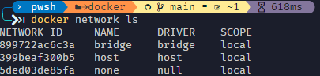
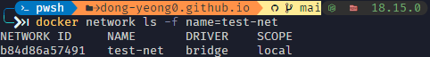

## Network 🤔

Docker container는 각각 격리된 환경에서 실행되기 때문에 기본적으로 다른 container와 통신이 불가능 합니다. 하지만 여려 개의 컨테이너를 하나의 Docker network에 연결을 시키면 서로 통신이 가능해 집니다.

## Network type

```shell
docker network ls
```

docker network ls command로 Docker가 지원하는 network 방식을 확인해 볼 수 있습니다.

{: width="500px"}
_bridge, host, none 3가지가 나오게 됩니다._

<br />

**docker network ls** command options

- **-f, –filter=[] : 조회 시 필터링 기능** (사실상 많이 씀)
- --no-trunc : network 정보를 상세히 출력 (ID 자세히 나옴)
- -q, –quiet : 나머지 정보 제외하고 network ID만 표시

```shell
# driver가 bridge인 network 조회
docker network ls -f driver=bridge

# network 이름이 none인 network 조회
docker network ls -f name=none
```

<br />

Docker network는 **bridge**, **host**, **overlay**, **none** 등등 여러 목적에 따라 여러 종류를 지원하고 있습니다.

### bridge

Docker network의 기본 network driver 입니다. 

driver를 따로 지정하지 않는 경우 default로 들어가게 됩니다.

### host

host network는 container와 host 컴퓨터의 동일한 network에서 container를 돌리기 위해서 사용됩니다.

### none

현재 container의 networking을 비활성화 하는 driver 입니다.

<br />

## Create network

```shell
docker network create test-net
```
default netwokr이 bridge인지 확인하기 위해 test-net 이라는 network를 생성합니다.

```shell
docker network ls -f name=test-net
```


_default인 bridge로 생성된 것을 확인할 수 있습니다._

## Detail netwokr information

```shell
docker network inspect test-net
```
