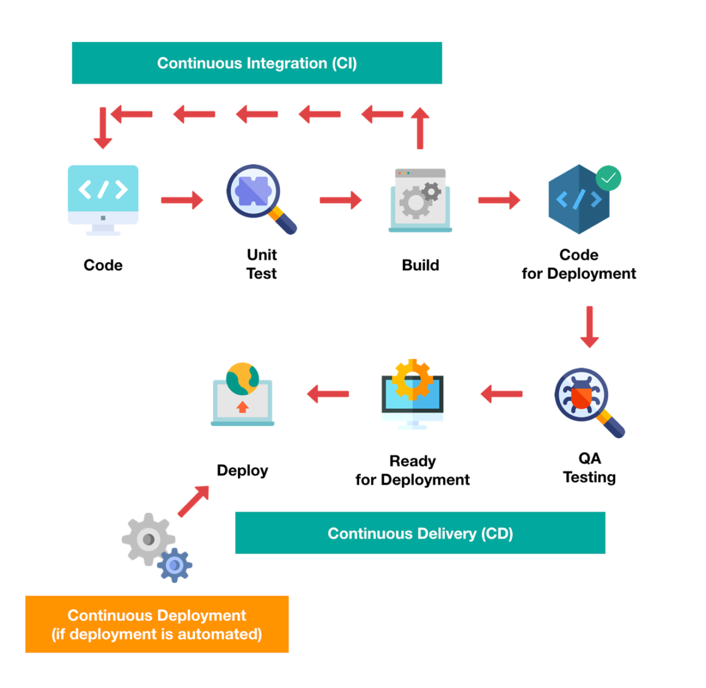
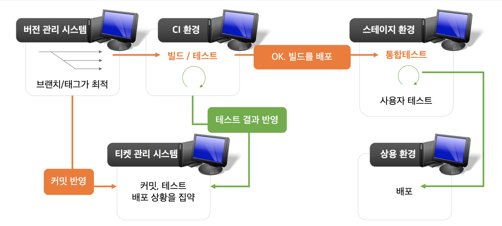

## Introduction

만약, 여러명의 개발자가 비지니스 앱을 개발하고 빌드 및 테스트를 끝낸 후 배포까지 하면 많은 시간이 소요가 됩니다.

**Develop - Build - Test - Deploy** 까지의 전 과정을 자동화 하는 것이 바로 CI/CD 입니다. 지금부터 CI/CD의 개념에 대해 정리해보겠습니다.

---

 

CI/CD는 Application 개발 단계를 자동화 하여 Application을 더욱 짧은 주기로 고객에게 제공하는 방법입니다.

또한, CI/CD의 기본 목표는 지속적인 통합, 지속적인 서비스 제공, 지속적인 배포입니다.

CI/CD는 새로운 코드 통합으로 인해 개발 및 운영팀에 발생하는 문제
(일명 "통합 지옥(integration hell)")를 해결하기 위한 솔루션 입니다.

_출처: [Red Hat](https://www.redhat.com/en/topics/devops/what-is-ci-cd)_

## CI (Continuous Integraion)

#### CI는 간단히 build, test 자동화 과정을 하는 과정

CI는 개발자를 위한 자동화 프로세스이다.

CI를 성공적으로 구현 할 경우  Application 에 대한 새로운 코드 변경 사항이 정기적으로 빌드 및 테스트되어 공유 Repository에 통합되므로 여러 명의 개발자가 동시에 Application개발과 관련된 코드 작업을 할 경우 서로 충돌할 수 있는 문제를 해결해 줍니다.

지속적 통합의 실행은 Source/Version 관리 시스템에 대한 변경 사항을 정기적으로 Commit하여 모든 사람에게 동일 작업 기반을 제공하는 것으로 시작.

**Commit할 때마다 빌드와 일련의 자동 테스트가 이루어져 동작을 확인하고 변경으로 인해 문제가 생기는 부분이 없도록 보장**합니다.

지속적 통합은 그 자체로 유익하지만, CI / CD Pipeline을 구현하기 위한 첫 번째 단계이기도 합니다.

---

## CD (Continuous Delivery, Deployment) 지속적인 서비스 제공, 배포

#### CD는 간단히 배포 자동화 과정

CD의 의미

1. 지속적인 서비스 제공(**Continuous Delivery**)
2. 지속적인 배포(**Continuous Deployment**)

이 두 용어가 똑같은 의미는 아닌 상호 교환적으로 사용이 됩니다.

두 가지 의미 모두 Pipeline의 추가 단계에 대한 자동화를 뜻하지만, 때로는 얼마나 많은 자동화가 이루어지고 있는지를 설명하기 위해 별도로 사용 되는 경우도 있습니다.

{:width="500"}
_출처: [MemoStack님의 Tistory](https://memostack.tistory.com/m/73)_

## (번외) 우아한 형제들의 기대하는 이상적인 시스템

_출처: [우아한형제들 기술블로그 라이더스 개발팀 모바일에서 CI/CD 도입](https://techblog.woowahan.com/2579/)_

### 끄적끄적 (분석)

CI, stage, production 총 3가지의 환경을 나누고 각 환경을 나누어서 역할을 배분하였다.

* **CI**
  * build와 test를 통해 **코드의 품질을 향상**시키는 것
  * 즉 항상 **test code를 통과하는 code만 통합 된 code만 repository에 올라가기 때문에** 항상 좋은 퀄리티를 유지할 것이다.
  
* **Stage**
  * CI환경에서 넘어 온 code를 테스트하는 환경 인 것 같다.

* **Production**
  * stage 환경에서 버그 및 결함이 없는 코드를 지속적 배포하면 클라이언트는 버그, 결함이 없는 정상적 application을 사용할 수 있는거 같다(?).
  
## Ref

[Red Hat: What is CI/CD?](https://www.redhat.com/en/topics/devops/what-is-ci-cd)

[MemoStack님의 CI/CD 개념 정리](https://memostack.tistory.com/m/73)

[우아한형제들 기술블로그 라이더스 개발팀 모바일에서 CI/CD 도입](https://techblog.woowahan.com/2579/)
