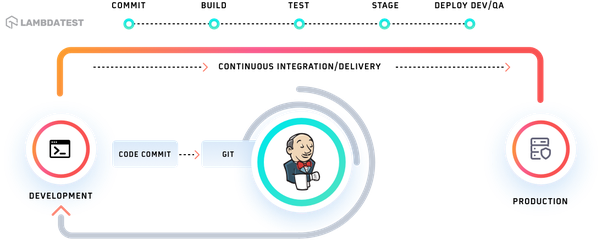
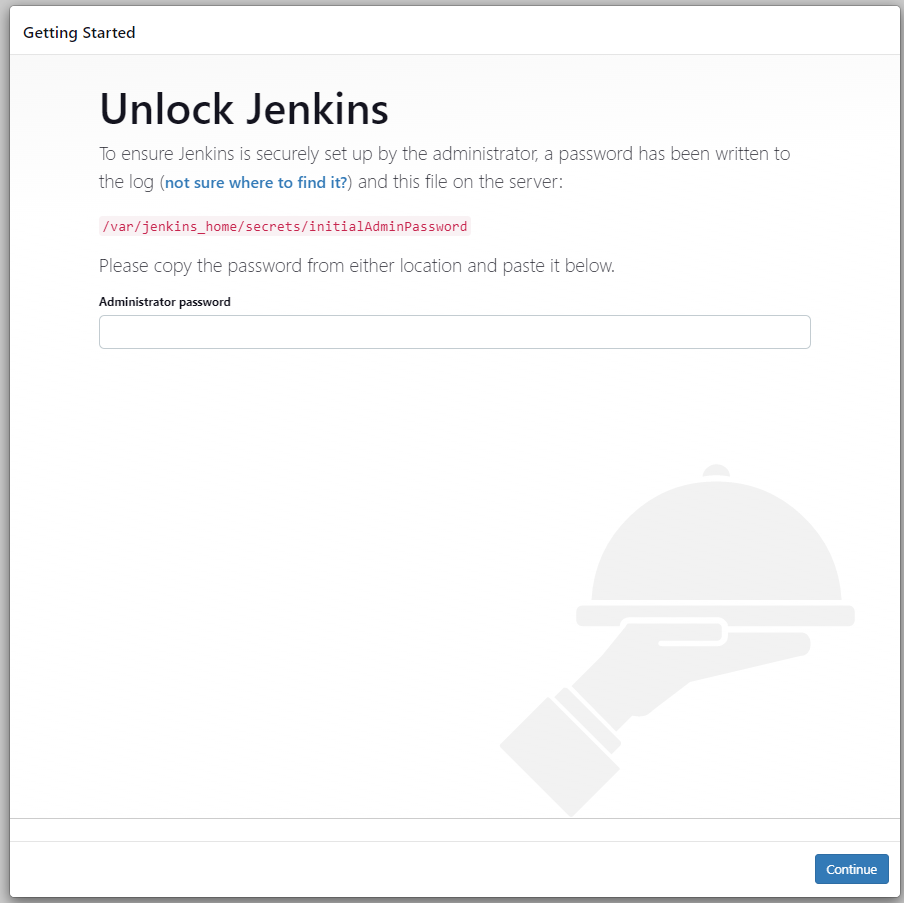
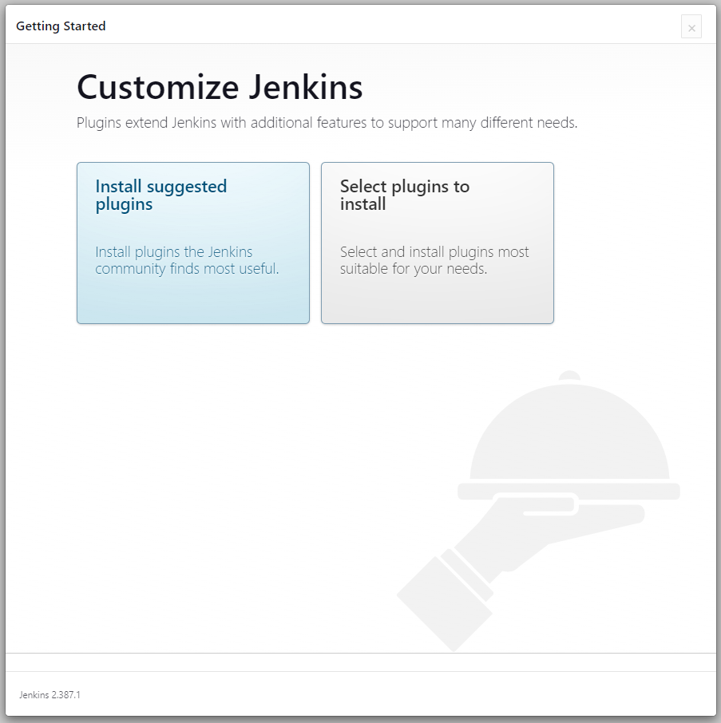

## Jenkins란?

모든 언어의 조합과 소스 코드 Repository에 대해 **지속적인 통합 (Continuous Integration, CI)**과 **지속적인 배포(Continuous Delivery, CD)** 환경을 구축하기 위한 도구입니다.

빌드, 테스트 ,배포 프로세스 등 자동화하여 소프트웨어 품질과 개발 생산성을 높일 수 있다.

## Jenkins 특징

1. 프로젝트 표준 컴파일 환경에서의 컴파일 오류 검출
2. 자동화 테스트 수행 : 코드 분석에 의한 코딩 규약 준수 여부 체크
3. 프로파일링 툴을 이용한 소스 변경에 따른 성능 변화 감시
4. 결함 테스트 환경에 대한 배포 작업
5. 애플리케이션 서버로의 Deploy(배포) 등 간략화

### 우리가 GitLab Webhook과 같이 사용하게 된다면.

{: width="1000px"}
_Jenkins Gitlab_

흐름상

1. Local에서 개발 후 Gitlab 커밋 및 푸시
2. Jenkins가 이를 인지하여 Build 및 test
3. Build가 성공할 경우 deploy서버로 전송
4. Build가 실패할 경우 log를 남기고 알림

## Install

### docker-compose.yml

```yml
version: '3.7'
services:
  jenkins:
    image: jenkins/jenkins:lts
    privileged: true
    user: root
    restart: always
    ports:
      - 8080:8080
    container_name: jenkins
    volumes:
      - "./jenkins_home:/var/jenkins_home"
      - "/var/run/docker.sock:/var/run/docker.sock"
    environment:
      TZ: "Asia/Seoul"
```

### run

```shell
# docker-compose.yml 있는 곳에
docker-compose up --build -d

# result
[+] Running 14/14
 - jenkins Pulled                                                                          12.4s
   - 32fb02163b6b Already exists                                                            0.0s
   - c09d5e9e1188 Pull complete                                                             4.2s
   - a56533012712 Pull complete                                                             4.3s
   - 7936e107ffe7 Pull complete                                                             4.4s
   - 3ca683058265 Pull complete                                                             4.4s
   - c2ecd304b4b8 Pull complete                                                             7.1s
   - be3512d810d6 Pull complete                                                             7.1s
   - 56b37d7c2a7a Pull complete                                                             7.2s
   - 99ed1e723e52 Pull complete                                                             7.9s 
   - 256db5485b13 Pull complete                                                             7.9s 
   - ee8c7eaf5e6b Pull complete                                                             7.9s 
   - 509f66c2f317 Pull complete                                                             8.0s 
   - 820296a845d6 Pull complete                                                             8.0s 
[+] Running 2/2
 - Network jenkins_default  Created                                                         0.0s 
 - Container jenkins        Started
```

실행 후 [localhost:8080](http://localhost:8080)에 접속하면

{:width="700px"}
_Jenkins 초기 화면_

다시 shell로 돌아와서

```shell
docker exec jenkins cat /var/jenkins_home/secrets/initialAdminPassword

# result
25516070842945298bb1e685c66c12db
```

위 command로 초기 비밀번호를 확인한 후 [방금 docker로 올린 Jenkins](http://localhost:8080)에 입력해 줍니다.

<br/>
정상적으로 입력이 되면 다음 페이지인 plugin install page가 나오게 됩니다.

{:width="700px"}
_왼쪽: 권장 plugins install, 오른쪽: 직접 선택해서 plugin들 install_
