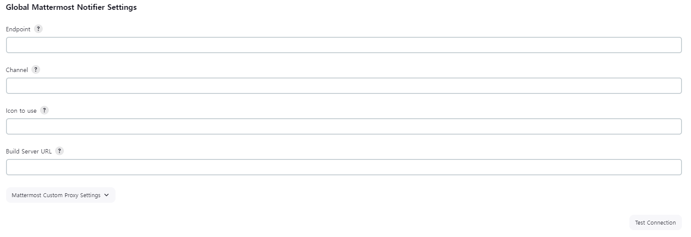

### Ref

[Mattermost Notification Plugin](https://www.jenkins.io/doc/pipeline/steps/mattermost/)

[[CI/CD] Jenkins와 Mattermost 연동](https://velog.io/@rungoat/CICD-Jenkins%EC%99%80-Mattermost-%EC%97%B0%EB%8F%99)

## 1. Mattermost 설정

### 참고사항

**가장 먼저 자신의 Mattermost 계정이 admin 권한을 가지고 있어야 합니다.**

### Webhook url 생성


Incomming Webhook에 들어갑니다.


Add Incoming Webhook을 클릭합니다.


각각의 정보를 넣습니다.

Title: Incoming Webhooks에 보여질 이름

Description: 해당 hook에 대한 설명

Channel: webhook payload를 수신하는 기본 공개 또는 비공개 채널입니다. webhook을 설정할 때는 비공개 채널에 속해야 합니다.

나머지 `Lock to this channel`, `Username`, `Profile Picture`은 설정이 딱히 필요없습니다.


생성하면 webhook url이 생성됩니다.

## 2. Jenkins 설정

### Mattormost Notification Plugin 설치


해당 플러그인을 설치합니다.

### Test



Manage Jenkins → System에서 Global Mattermost Notifier Settings에 정보를 입력합니다.

Endpoint: webhook url (아까 복사한 url)

Channel: 알람을 보낼 채널 이름 (**소문자로 기입**)

입력 후 Test Connection을 클릭하면 `Success` 가 나오개 되며, 채널에 알림이 오게 될 것 입니다.


## Pipeline

```groovy
pipeline {
    agent any
    
    stages {
        
        stage('Hello world') {
            # ...
        }
        
        # ...
    }
    post {
        success {
        	script {
                mattermostSend (
									color: 'good', 
	                message: "빌드 성공: ${env.JOB_NAME} #${env.BUILD_NUMBER} by ${Author_ID}(${Author_Name})\n(<${env.BUILD_URL}|Details>)", 
	                endpoint: '{endpoint입력}', 
	                channel: '{channel입력}'
                )
            }
        }
        failure {
        	script {
                mattermostSend (
									color: 'danger', 
	                message: "빌드 실패: ${env.JOB_NAME} #${env.BUILD_NUMBER} by ${Author_ID}(${Author_Name})\n(<${env.BUILD_URL}|Details>)", 
	                endpoint: '{endpoint입력}', 
	                channel: '{channel입력}'
                )
            }
        }
    }
}
```
