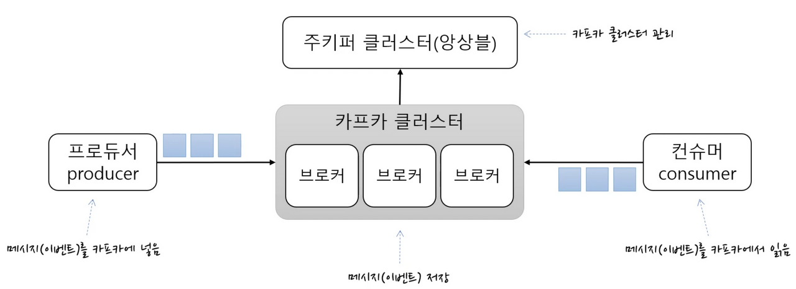

<iframe src="https://giphy.com/embed/tIeCLkB8geYtW" width="100%" height="378" frameBorder="0" class="giphy-embed" allowFullScreen></iframe>
<a href="https://giphy.com/gifs/shaun-the-sheep-movie-not-my-gif-2016-oscar-nominations-tIeCLkB8geYtW">via GIPHY</a>

## Kafka란?

카프카는 분산 메세징 시스템 or 이벤트 스트리밍 시스템 또는 미들웨어라 불리며

**메세지(데이터)의 송신자(Publisher)와 수신자(Consumer)의 중개를 하는 시스템 입니다**.

대용량, 대규모 메세지 데이터를 빠르게 처리하도록 개발된 송신자(Publisher)와 수신자(Consumer)의 중개하는 역할을 합니다.

또한 **분산 환경에 특화**되는 특징을 가지고 있습니다.

**MQTT or RabbitMQ**는 메세지(데이터) 저장보다는 **실시간 메시징 및 통신**에 더 중점을 두고 있습니다. 즉 **데이터 소비가 이루어지면 데이터가 지워지는 특성**이 있습니다

다만 **Kafka**는 **바로 지워지지 않고** **디스크에 유지**되고 있어 **복원**은 물론 소비된 메세지 추적 개념의 offset, commit이 있어 **장애가 난 시점을 찾기 쉬우며** 보다 쉽게 대응을 할 수 있습니다.

**카프카는 다양한 사용 사례에 적용됩니다.**

- 증권 거래소, 은행 및 보험과 같은 실시간으로 지불 및 금융 거래를 처리
- 물류 및 자동차 산업과 같이 자동차, 트럭, 차량 및 선적을 실시간으로 추적하고 모니터링
- 공장 및 풍력 발전 단지와 같은 IoT 장치 또는 기타 장비의 센서 데이터를 지속적으로 캡처하고 분석
- 소매, 호텔 및 여행 산업, 모바일 애플리케이션과 같은 고객 상호 작용 및 주문을 수집하고 즉시 대응
- 병원에서 치료 중인 환자를 모니터링하고 상태 변화를 예측하여 응급 상황에서 시기 적절한 치료를 보장
- 회사의 여러 부서에서 생성된 데이터를 연결, 저장 및 사용 가능하게 만듦
- 데이터 플랫폼, 이벤트 중심 아키텍처 및 마이크로서비스(MSA)의 기반 역할

## 카프카의 특징

1. **대량의 데이터를 고속으로 처리할 수 있다.**

    빅데이터, IoT와 같은 데이터가 많을 경우를 고려하면 대량의 데이터를 고속으로 처리할 수 있는 것은 매우 중요합니다. **Kafka는 Pub-Sub 메시징 모델과 약간 다른 구성**이 되어 있고, **여러 Broker 구성**으로 되어 있어 스케일 아웃을 하기 쉽다. 스케일 아웃의 용이성은 빠른 처리 향상에 직결됩니다.

2. **자유로운 타이밍에서의 데이터 이용이 가능하다.**

    앞에서 언급한 `고속` 이라고 하는 것은 real-time 처리를 말하지만, 반드시 real-time 처리 뿐만은 아니라는 점. Kafka에 접속되는 Consumer는 다양한 종류의 처리 및 일괄 처리를 하는 경우도 있다. 또한, 데이터도 곧바로 사용하는 것은 아니고, Broker내에서 장기간에 걸쳐 보존이 필요한 경우가 있지만, **Kafka에서는 데이터를 메모리상 뿐만이 아니라 디스크에 기입하는 것으로 영속적인 보존을 가능하게 한다**. 이렇게 함으로써 데이터를 자유롭게 사용할 수 있습니다.

3. 고속성**을 유지하면서 데이터의 송신 보증이 가능하다.**

    데이터의 전달 보증이라고 하면, 1건씩 데이터에 대한 트랜잭션 처리가 쉬울 수 있다고 생각할 수도 있지만, 이는 실행하면서 고속으로 데이터를 처리한다는 것은 난이도가 매우 높다. 그리고 당연히 도중에 **데이터가 손실**되는 것도 피해야 한다. 가장 엄격한 데이터 전달 보증은 “1건의 데이터를 확실히 1회씩 보내기”(**Exactly at once**)이지만, Kafka에서는 “(중복이어도 상관 없기 때문에) 적어도 1회는 확실하게 데이터를 송신한다”(**At least once**)를 실현함으로써 고속성과 데이터 전달 보증의 균형을 맞추고 있다.

4. **데이터를 송수신하기 위한 API가 충실하다**

    Kafka에 접속되는 Producer/Consumer(Producer는 Pub-Sub 메시징 모델의 Publisher에 해당)는 하나만 있는 것이 아니고, 다른 시스템에 속하고 있는 경우도 많다. 이러한 경우에는 Publisher/Subscriber와 Kafka 사이에 접속용 API가 중요해 진다. 접속 API의 역할을 하는 것으로서 “Kafka Connect”(및 Kafka Connect 접속하는 Connector 플러그인)가 제공되고 있다. API를 사용자 측에서 개발하는 것은 매우 번거롭기 때문에 풍부한 API를 제공하면 개발 효율성을 높이는 데 도움이 된다.

그 밖에 특징들

- 멀티 프로듀서, 멀티 컨슈머
  - 카프카는 하나의 토픽에 여러 프로듀서 또는 컨슈머들이 접근 가능한 구조로 되어 있습니다.
  - 데이터 분석 및 처리 프로세스에서 하나의 데이터를 다양한 용도로 사용하는 요구가 많아지기 시작했고, 멀티 기능 덕분에 이러한 요구를 손쉽게 충족할 수 있습니다.
- 디스크에 메시지 저장
  - 디스크에 메시지를 저장하고 유지합니다, **즉 지워지지 않는 비휘발성 특징을 가집니다**.
  - 컨슈머가 메시지를 읽어가더라도 보관 주기 동안 디스크에 메시지를 저장합니다.
- 확장성
  - 카프카는 확장이 매우 용이하도록 설계되어 있다. 하나의 카프카 클러스터는 3대의 브로커로 시작해 수집 대의 브로커로 확장이 용이합니다.
  - 확장 작업은 카프카 서비스의 중단 없이 온라인 상태에서 작업이 가능합니다.
- 높은 성능
  - 고성능을 유지하기 위해 카프카는 내부적으로 분산 처리, 배치 처리 등 다양한 기법을 사용하고 있습니다.

## 카프카의 Broker, Producer, Consumer

### Broker

카프카 브로커는 프로듀서로부터 메시지를 전달받고, 다시 이를 컨슈머로 전달하는 역할을 담당합니다. 또한 브로커는 **일반적으로 '카프카'라고 불리는 시스템을 말합니다.** 프로듀서와 컨슈머는 별도의 애플리케이션으로 구성되는 반면, 브로커는 카프카 자체이기 때문입니다. 따라서 '카프카를 구성한다' 혹은 '카프카를 통해 메시지를 전달한다'에서 카프카는 브로커를 의미합니다.

### Producer

Producer, 즉 송신자는 메세지(데이터)를 발행하여 생산(Write)하는 주체입니다.
producer는 메세지 전송 시 토픽을 지정하여 저장을 합니다.

### Consumer

Consumer, 즉 수신자는 메세지(데이터)를 소비(Read)하는 주체입니다.

- Consumer Group
  메세지를 소비하는 Consumer들의 논리적 그룹
  토픽의 파티션은 컨슈머그룹과 1:N 매칭 관계로 동일 그룹내 한 개의 컨슈머만 연결이 가능합니다.
  파티션의 메세지는 순서대로 처리되도록 보장하며, 특정 컨슈머에 문제가 생겼을때 Fail over를 통한 리밸런싱 가능
  파티션과 컨슈머는 1:1이 best practice로 봅니다.

## 카프카와 Zookeeper 관계

분산 application을 사용하게 되면, 관리를 위한 안정적인 코디네이션이 추가로 필요하게 됩니다.

안정적인 코디네이션 서비스로 검증된 주키퍼를 많이 사용합니다.

**주키퍼**는 분산 application을 위한 코디네이션 시스템 입니다. 분산 application이 안정적인 서비스를 할 수 있도록 분산되어 있는 각 application의 정보를 중앙에 집중시키고 구성관리, 그룹 관리 네이밍, 동기화 등의 서비스를 제공합니다.

**상태 정보**들은 주키퍼의 지노드(znode)라고 불리는 곳에 key-value 형태로 저장하며, 지노드에 저장된 것을 이용하여 분산 application들은 서로 데이터를 주고 받게되는 구조 입니다.

znode를 일반 컴퓨터의 파일이나 폴더 개념으로 생각하시면 편합니다. 우리가 알고 있는 일반적인 디렉토리와 비슷한 형태로서 자식노드를 가지고 있는 계층형 구조로 구성되어 있습니다.

주키퍼는 좀 더 신뢰성 있는 서비스를 위해 앙상블(클러스터)이라는 호스트 세트를 구성할 수 있습니다. 앙상블로 구성되어 있는 주키퍼는 과반수 방식에 따라 살아 있는 노드 수가 **과반수 이상** 유지된다면, 지속적인 서비스가 가능합니다.

- Case1. 주키퍼 클러스터 3대 구성
  - 노드 1대 다운: 과반수 유지 이므로 서비스 가능
  - 노드 2대 다운: 과반수가 유지되지 않아 서비스 불가
- Case2. 주키퍼 클러스터 5대 구성
  - 노드 2대 다운: 과반수 유지 이므로 서비스 가능

## Ref

[Apache Kafka 공식문서](https://kafka.apache.org/protocol#protocol_network)
[[Kafka] 카프카란? 주요개념 및 용어 소개 by IfUWanna](https://ifuwanna.tistory.com/487)
