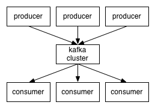
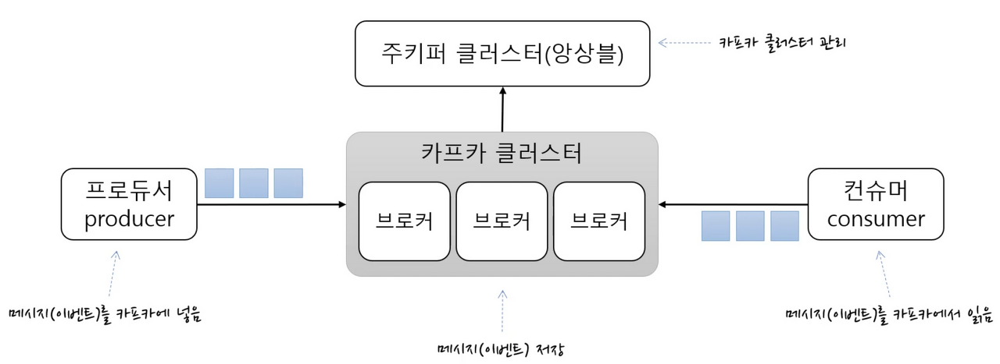
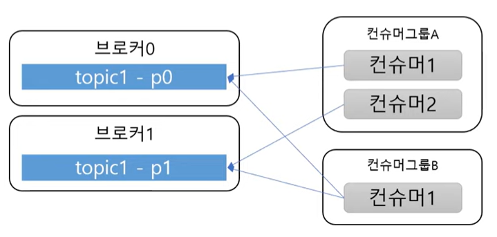

### Introduction

먼저 몇 가지 기본적인 흐름을 살펴보겠습니다. 

1. Kafka는 topic이라는 범주로 메시지 피드를 유지 관리합니다. 
2. Kafka topic 생산자에게 메시지를 게시하는 프로세스를 호출합니다. 
3. 주제를 구독하고 게시된 메시지 소비자의 피드를 처리하는 프로세스를 호출합니다. 
4. Kafka는 각각 브로커라고 불리는 하나 이상의 서버로 구성된 클러스터로 실행됩니다.

따라서 high level에서 생산자는 네트워크를 통해 Kafka 클러스터로 메시지를 보내고 Kafka 클러스터는 아래와 같이 소비자에게 메시지를 제공합니다.

_[카프카 공식문서](https://kafka.apache.org/090/documentation.html)_

_[최범균님 Kafka 조금 아는 척하기 1 (개발자용) 중](https://kafka.apache.org/090/documentation.html)_

### 프로듀서 (Producers)

프로듀서는 카프카 토픽에 **메시지를 게시하는 주체** 입니다.

넓은 의미로, 데이터를 생성하는 모든 애플리케이션이나 시스템이 프로듀서가 될 수 있습니다.

프로듀서는 특정 토픽에 메시지를 작성하며, 메시지가 토픽 내의 파티션에 어떻게 분산되는지를 제어하기 위해 메시지 키를 정의할 수 있습니다.

또한 프로듀서는 기본적으로 라운드로빈(골고루 돌아가면서) 또는 키로 파티션을 선택하여 토픽 저장을 할 수  있습니다.

### 컨슈머 (Consumers)

컨슈머는 카프카 토픽을 구독하여 **메시지를 읽고 처리하는 소비의 주체** 입니다.

카프카는 컨슈머 그룹(Consumer Groups)과 단일 컨슈머(Single Consumer) 두 가지 유형의 컨슈머를 지원합니다.

컨슈머 그룹을 사용하면 여러 컨슈머가 병렬로 작동하여 토픽 내의 다른 파티션에서 메시지를 소비하며 수평 확장성을 제공합니다.

### 컨슈머 그룹

기본적으로 컨슈머는 컨슈머그룹에 속해 있습니다.

**한 개의 파티션**은 컨슈머그룹의 **한 개의 컨슈머에만 연결 가능** 합니다. (**한 개의 토픽이 아닌 하나의 파티션**)

즉 컨슈머그룹에 속한 다른 컨슈머들은 한 파티션을 공유할 수 없습니다. 한 파티션 기준 한 컨슈머그룹에 2명 이상의 컨슈머는 공유가 안된다는 의미 입니다. 이로서 가능한 점은 한 컨슈머그룹 기준으로 파티션의 메세지는 순서대로 처리가 됩니다.

_[최범균님 Kafka 조금 아는 척하기 1 (개발자용) 중](https://kafka.apache.org/090/documentation.html)_

위 그림을 볼 때 컨슈머그룹 A의 컨슈머1과 컨슈머2는 브로커0의 topic1 - 파티션1을 함께 공유한다거나 파티션2번을 서로 공유를 할 수 없습니다.

이로서 가능한 점은 한개의 컨슈머만 한개의 파티션을 연결할 수 있어 컨슈머 그룹 기준으로 파티션의 메세지가 순서대로 처리되는 것을 보장할 수 있음.

### Ref

[Apache Kafka](https://kafka.apache.org/090/documentation.html)

[아파치 카프카(Apache Kafka) 아키텍처 및 동작 방식](https://engkimbs.tistory.com/691)

[kafka 조금 아는 척하기 1 (개발자용)](https://youtu.be/0Ssx7jJJADI?si=NOhe08-IqMxKDt_I)
